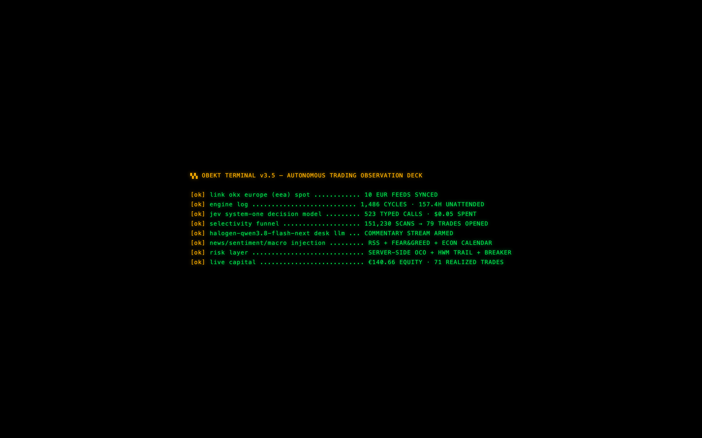
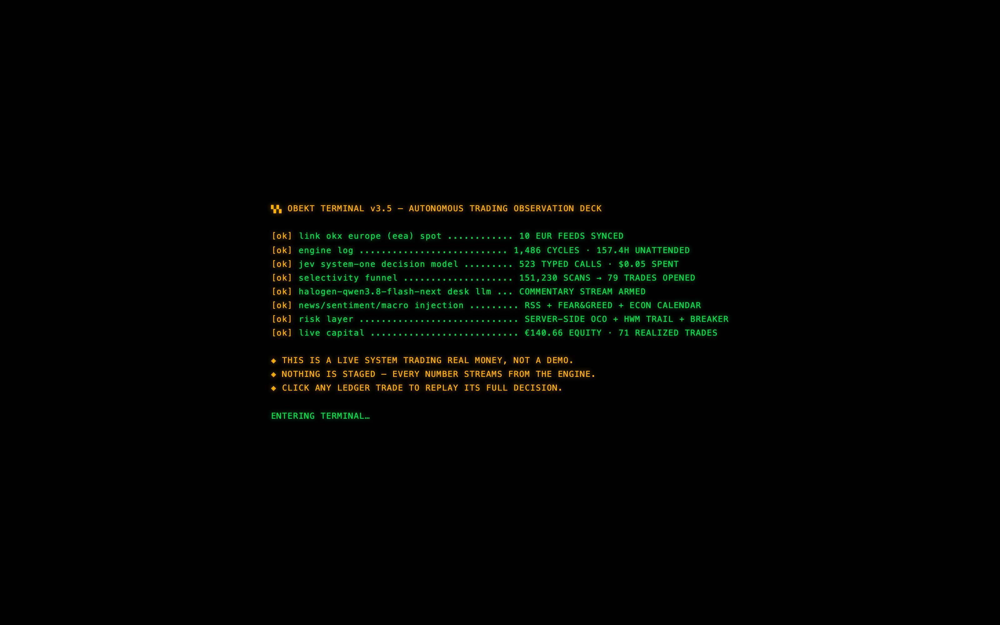
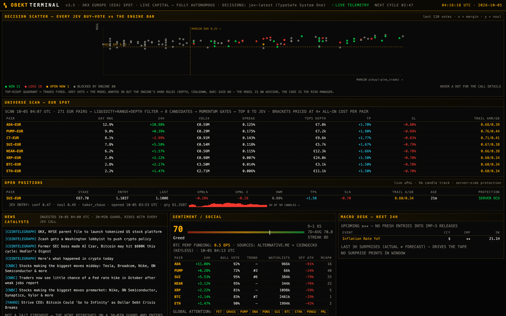
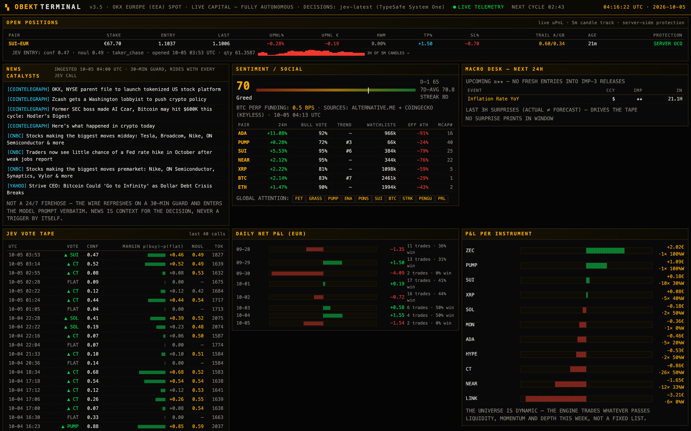
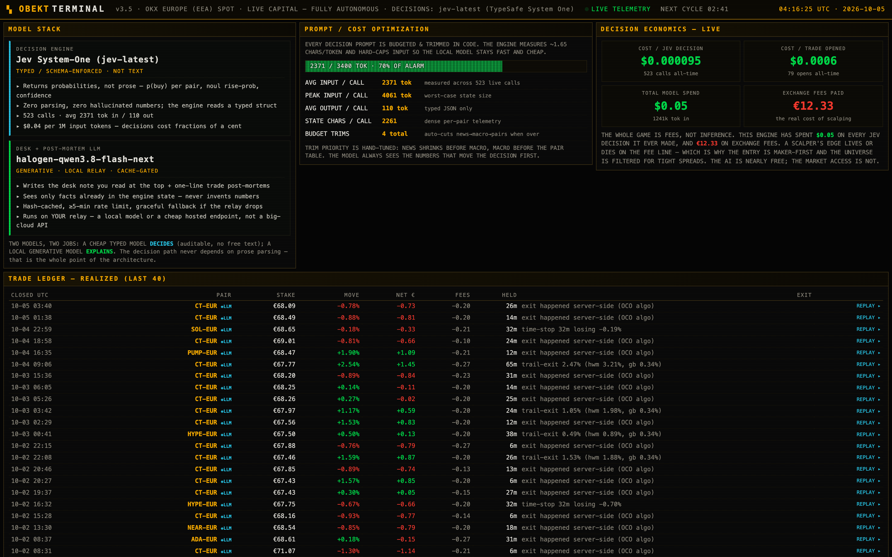
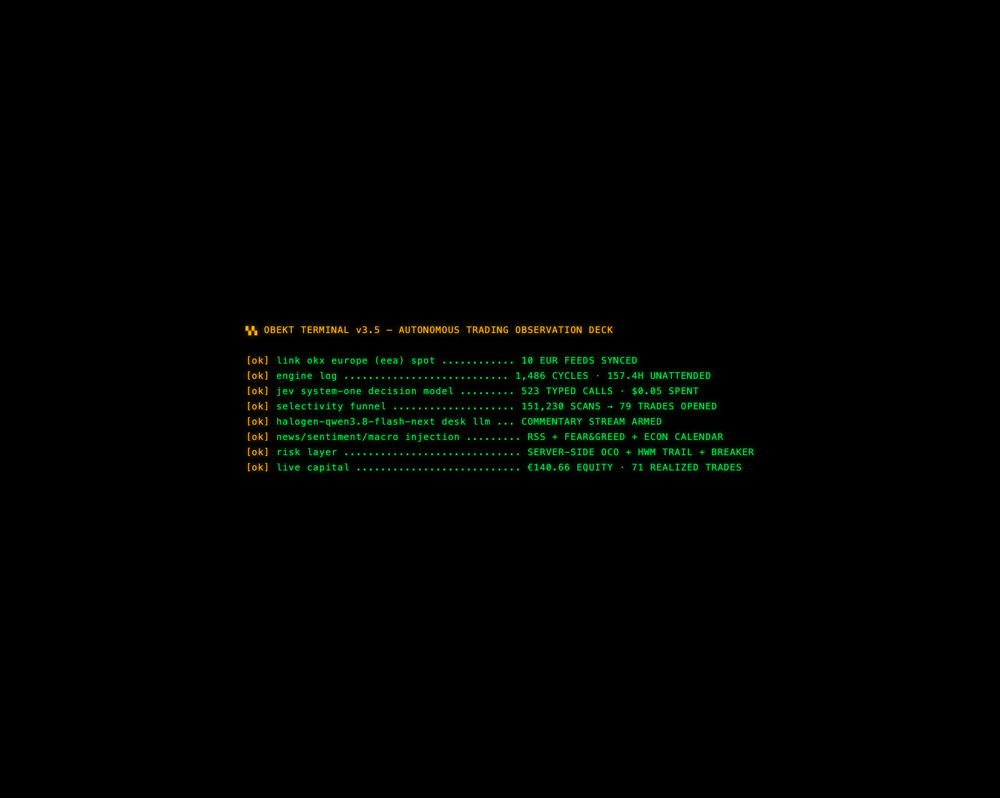

<div align="center">

# ▚ OBEKT AUTONOMOUS TRADING PLATFORM

### A real trading bot, on real money, that reads the news, asks a decision-model, and manages its own risk — and a Bloomberg-style terminal so you can watch every thought it has.

**Open-source · Runs on a local LLM · Decisions cost fractions of a cent · Built by [Obekt AI Works](https://obekt.com)**

### 🔴 [**LIVE DEMO → trader.obekt.com**](https://trader.obekt.com) — watch the real system trade right now



[**▶ LIVE DEMO**](https://trader.obekt.com) · [**What it is**](#what-this-is) · [**Live screenshots**](#what-it-looks-like) · [**How it thinks**](#how-it-thinks-the-architecture) · [**Run it**](#run-it) · [**The terminal**](#the-observation-terminal) · [**Costs**](#what-it-costs) · [**⚠ Disclaimer**](#the-boring-but-important-part)

</div>

---

> ### ⚠️ THIS IS NOT FINANCIAL ADVICE. IT IS A PURE EXPERIMENT.
>
> This is an **educational experiment** and a **portfolio piece**. It trades **real money** and it **can and does lose money** — the screenshots on this page include losing trades, a sub-1.0 profit factor, and red days, because that is the honest result and we are not going to hide it. Nothing here is a recommendation, a solicitation, a signal service, or a promise of profit. Automated trading can lose your entire balance in seconds. **Do not run this with money you cannot afford to set on fire.** If you trade on it, you own every consequence. See [DISCLAIMER.md](DISCLAIMER.md).

---

## What this is

Most "AI trading bot" repos are a backtest with a line chart. This is not that.

This is a **fully autonomous system that has been trading live crypto on real capital, unattended, for days** — and a **read-only terminal** that streams every decision it makes, so you can watch an agent *think* in real time.

Two pieces, both in this repo:

| | What it does |
|---|---|
| **`engine/`** — the trader | Scans ~270 EUR spot pairs every 5 minutes, filters them with deterministic liquidity/momentum/depth gates, injects live **news + sentiment + macro**, asks the **Jev System-One** decision model for a *typed* verdict (probabilities, not prose), and if the bar is cleared, enters maker-first and manages the exit with **server-side OCO + trailing stops**. Risk lives in code, never in the model. |
| **`terminal/`** — the observation deck | A **Bloomberg-style text UI** (pure HTML/CSS/JS, no framework) that reads the engine's raw log and renders it: equity curve, selectivity funnel, decision scatter, the exact prompt state the model saw, a candlestick replay of every trade, and a **local LLM** writing the desk commentary. **Nothing is clickable except the trade replay** — it is observation only, by design. |

The thesis, in one line: **a cheap typed decision-model chooses, deterministic code enforces risk, a local LLM explains, and a human watches — none of them parse each other's prose.**

---

## What it looks like

Every number below is real, pulled live from the running engine. Including the losses.

<table>
<tr>
<td width="50%"><br/><sub><b>1 · The live deck.</b> Hero KPIs (equity, day P&L, cycles run, model calls), the session-liveness strip that counts events <i>since you opened the tab</i>, the LLM desk note, and the scrolling price marquee with sparklines.</sub></td>
<td width="50%"><br/><sub><b>2 · Why it barely trades.</b> The <b>selectivity funnel</b> (~140,000 pair-scans → a handful of fills), the <b>exit-engine breakdown</b>, and P&L by entry hour. Saying "no" is the job.</sub></td>
</tr>
<tr>
<td width="50%"><br/><sub><b>3 · The decision scatter.</b> Every model buy-vote plotted as <i>margin × noul</i> against the engine's hard bars, colored by outcome. Grey dots = the model wanted in, <b>the code said no</b>. That grey cloud is the risk layer earning its keep.</sub></td>
<td width="50%"><br/><sub><b>4 · Flat is a position.</b> Open positions with live uPnL and 5m candle tracks, the exact <b>news catalysts</b> riding in every prompt, and sentiment (Fear &amp; Greed, community polls, funding).</sub></td>
</tr>
<tr>
<td width="100%"><br/><sub><b>5 · The honest economics.</b> <b>Model stack</b> (typed decider vs local explainer), <b>prompt/cost optimization</b> (a hard token budget, trimmed in code), and <b>decision economics</b>: total AI spend vs exchange fees paid. Spoiler — the AI is nearly free; market access is not.</sub></td>
</tr>
</table>

And the piece that makes people lean in — **click any trade in the ledger** and you get a full **decision replay**:

<div align="center">


*A single trade, reconstructed: the candlestick chart with entry/exit + TP/SL marked, the model's vote and probabilities, the exact market state it was shown, the news that was in the prompt, the pre-entry gauntlet it survived, the full lifecycle timeline, the ledger outcome, and a one-line LLM post-mortem.*
</div>

---

## How it thinks (the architecture)

```
   every 5 minutes, unattended:
   ┌──────────────────────────────────────────────────────────────┐
   │ 1. SCAN      ~271 EUR spot pairs   (keyless public feed)        │
   │ 2. FILTER    liquidity · spread · 24h range · top-5 book depth  │  ← deterministic code
   │ 3. GATE      30m trend · green bars · range pos · taker share   │     rejects 99%+
   │ 4. CONTEXT   RSS news · Fear&Greed · funding · econ calendar    │  ← keyless feeds
   │              multi-timeframe 30m / 4h / 7d                       │
   │ 5. DECIDE    ── Jev System-One ──►  typed: p(buy) · noul · conf │  ← $0.04 / 1M tok
   │ 6. VETO      margin≥.25 or conf≥.5, AND noul≥.45                │  ← code owns risk
   │              then LIVE book re-check: depth ≥ 3× stake           │
   │ 7. EXECUTE   maker-first entry · stake = free cash / slots       │
   │              server-side OCO TP/SL attached at fill              │
   │ 8. MANAGE    HWM trailing stop re-armed on-exchange · time-stop  │  ← survives even if
   │              cooldowns · −8% daily breaker                       │     this box dies
   └──────────────────────────────────────────────────────────────┘
                          │
                          ▼  raw JSONL telemetry (every scan, gate, vote, fill)
   ┌──────────────────────────────────────────────────────────────┐
   │  THE TERMINAL  reads the log → renders it → a local LLM writes   │
   │                the desk note. Observation only. Nothing staged.  │
   └──────────────────────────────────────────────────────────────┘
```

**The key design decision:** the decision model returns **typed JSON** (`p(buy)` per pair, a `noul` rise-probability, a `confidence`) — **never free text**. So there is no prompt-injection surface, no number hallucination, and nothing to parse. The model is an *advisor*; **deterministic code is the risk manager** and holds veto power. The local LLM only ever *explains* facts that are already in the engine state — it never decides, and it can't invent a number that isn't there.

Full detail lives in the skills: [`skills/system-one-decisions`](skills/system-one-decisions/SKILL.md) (how to use a typed decision model well) and [`skills/okx-trading`](skills/okx-trading/SKILL.md) (venue specifics, the fee wall, the pitfalls we hit live).

---

## Run it

There are two things you can run. **The terminal needs no credentials** — you can be looking at it in 30 seconds.

### A) Just the terminal (zero credentials, 30 seconds)

See the dashboard with real frozen telemetry from our live run:

```bash
cd terminal
cp sample_data/data.js data.js
cp sample_data/data.json data.json
cp -r sample_data/dossiers dossiers
python3 -m http.server 8770
# open http://localhost:8770
```

That's it — the full deck, charts, and click-to-replay trade dossiers, driven by our real (anonymized) data. No keys, no network, no risk.

### B) The full live system (your capital, your keys, your responsibility)

Read [DISCLAIMER.md](DISCLAIMER.md) first. Then:

**1. Prerequisites** — Python 3.9+, and a Node/OpenAI-compatible endpoint if you want desk commentary.
```bash
# decision model key (TypeSafe Jev — ~$0.04 per million input tokens)
mkdir -p ~/.config/typesafe && cat > ~/.config/typesafe/credentials.json <<'JSON'
{ "api_key": "YOUR_TYPESAFE_KEY" }
JSON
chmod 600 ~/.config/typesafe/credentials.json

# exchange key (READ-ONLY + TRADE perms; EEA users must use eea.okx.com)
mkdir -p ~/.config/okx && cat > ~/.config/okx/credentials.json <<'JSON'
{ "api_key": "***", "secret": "***", "passphrase": "***", "base": "https://eea.okx.com" }
JSON
chmod 600 ~/.config/okx/credentials.json
```

**2. Configure the engine.** All strategy knobs are constants at the top of [`engine/okx_jev.py`](engine/okx_jev.py) (bracket ratios, gates, bars, stakes, cooldowns, breaker). Read them. Change them. They are the whole strategy.

**3. Point it at a workspace and do a dry run.**
```bash
export OKX_TERMINAL_BASE=~/.hermes/workspace/okx     # where the engine writes its log/state
cd engine
python3 okx_jev.py status      # account + positions summary
python3 okx_jev.py cycle       # ONE full cycle: scan → gate → decide → (maybe) trade → manage
```

**4. Loop it.** The engine is designed to run every 5 minutes from cron (or any scheduler):
```cron
*/5 * * * * cd /path/to/engine && /usr/bin/python3 okx_jev.py cycle >> cycle.log 2>&1
```
Kill switch: `touch engine/STOP` halts new entries instantly (management of open positions continues).

**5. Run the terminal over the live log.**
```bash
cd terminal
export OKX_TERMINAL_BASE=~/.hermes/workspace/okx
# optional desk-commentary LLM (any OpenAI-compatible endpoint; local works):
export TERMINAL_LLM_URL="http://localhost:1234/v1/chat/completions"   # e.g. LM Studio / llama.cpp
export TERMINAL_LLM_MODEL="qwen3-flash"                               # any local flash model
python3 serve.py --port 8770     # rebuilds from the live log every 45s
```

See [`engine/README.md`](engine/README.md) and [`terminal/README.md`](terminal/README.md) for the full details, every env var, and how to host the terminal publicly.

---

## The observation terminal

A single-page, zero-dependency text UI — no React, no build step, no CDN. Just `index.html`, `style.css`, `app.js`, and a `data.js` the generator rebuilds from the engine's raw log.

- **25 panels**: hero KPIs · session-liveness counter · LLM desk note · performance · latest decision (with what the engine *did* with it) · gate checklist · **equity curve** · **selectivity funnel** · **decision scatter** · exit breakdown · P&L by hour/instrument · universe scan · open positions · news · sentiment · macro · vote tape · daily P&L · architecture · **model stack** · **cost optimization** · **decision economics** · trade ledger · event tape.
- **Real-time feel**: the page polls `data.js` every 10s, new tape rows flash, the tab title blinks on a fill, and a live `NEXT CYCLE` countdown ticks from the last engine event.
- **Click-to-replay dossiers**: every closed trade stores an immutable replay (chart + vote + prompt state + timeline + LLM post-mortem).
- **Read-only by construction**: `cursor:default`, `user-select:none`, no links or handlers anywhere except the ledger replay. You literally cannot place an order from it.

---

## What it costs

The economics panel says it better than we can, but the headline:

- **Decisions:** the Jev System-One model is ~**$0.04 per million input tokens**. A full decision round is a few thousand tokens → **~$0.0001 per call**. Thousands of decisions for a few cents.
- **Desk commentary:** runs on **your local model** (or any cheap endpoint) — effectively free, cached, and optional.
- **The real cost is the exchange.** Fees and spread are what actually eat a scalper. This engine is maker-first and filters hard for tight spreads *because* of that. Look at the "decision economics" panel: total AI spend is rounding-error next to the fee line.

---

## For agents

This whole thing is written to be **operated by an AI agent**, not just a human. The `skills/` directory is the operating manual in [Hermes Agent](https://hermes-agent.nousresearch.com) skill format — drop them in and an agent can run, tune, and debug the system:

- [`skills/okx-trading`](skills/okx-trading/SKILL.md) — venue auth, the EEA quirks, the fee wall, every live pitfall we hit (thin books, frozen balances, stale fills, dust phantoms).
- [`skills/system-one-decisions`](skills/system-one-decisions/SKILL.md) — how to use a typed decision model: atomic questions, margin-vs-confidence gating, state design, calibration by replay.

---

## Repository layout

```
├── README.md               ← you are here
├── DISCLAIMER.md           ← read it
├── LICENSE                 ← MIT (code) — no warranty, no advice
├── docs/screenshots/       ← the images above
├── engine/                 ← the autonomous trader
│   ├── okx_jev.py          ← the whole strategy: scan→gate→decide→execute→manage
│   ├── news_feed.py        ← keyless RSS catalyst feed
│   ├── social_feed.py      ← keyless Fear&Greed + CoinGecko sentiment
│   └── README.md
├── terminal/               ← the read-only observation deck
│   ├── index.html  app.js  style.css
│   ├── generate.py         ← log → data.js (+ LLM desk note, cached)
│   ├── serve.py  deploy.sh  make_og.py
│   ├── sample_data/        ← frozen real telemetry → preview with ZERO credentials
│   └── README.md
└── skills/                 ← agent operating manuals
    ├── okx-trading/
    └── system-one-decisions/
```

---

## Security & secrets

This repo contains **no keys, no credentials, and no personal infrastructure**. The engine reads keys from `~/.config/*/credentials.json` at runtime; the terminal reads an LLM key from an env var. Nothing is committed. Before publishing we scanned every source file and the sample telemetry for secrets and personal identifiers — see [SECURITY.md](SECURITY.md) for what we checked and how to run your own audit.

---

## The boring but important part

- **Not financial advice.** Not investment advice. Not a signal service. Not a product. An experiment, published as-is.
- **It loses money.** The live screenshots include red days, a losing trade marked "WORST", and a profit factor under 1.0 over the sample window. That is real. Markets are adversarial and a small retail scalper pays a heavy fee toll. We show the real numbers because fake ones would be a lie.
- **You are responsible.** If you point this at a funded account, every fill, every loss, and every consequence is yours alone.
- **No warranty.** MIT-licensed, zero warranty, zero liability. See [LICENSE](LICENSE) and [DISCLAIMER.md](DISCLAIMER.md).
- **Do your own research.** Then do more. Then assume you're still missing something.

---

<div align="center">

**Built by [Obekt AI Works](https://obekt.com)** — agents that do real things on real systems.

If you looked at this and thought *"I want one of these for my book / my stack / my idea"* — that's exactly what we build. **[obekt.com](https://obekt.com)**

⭐ If this made you go "huh, that's actually real" — star it. It helps other people find it.

</div>
